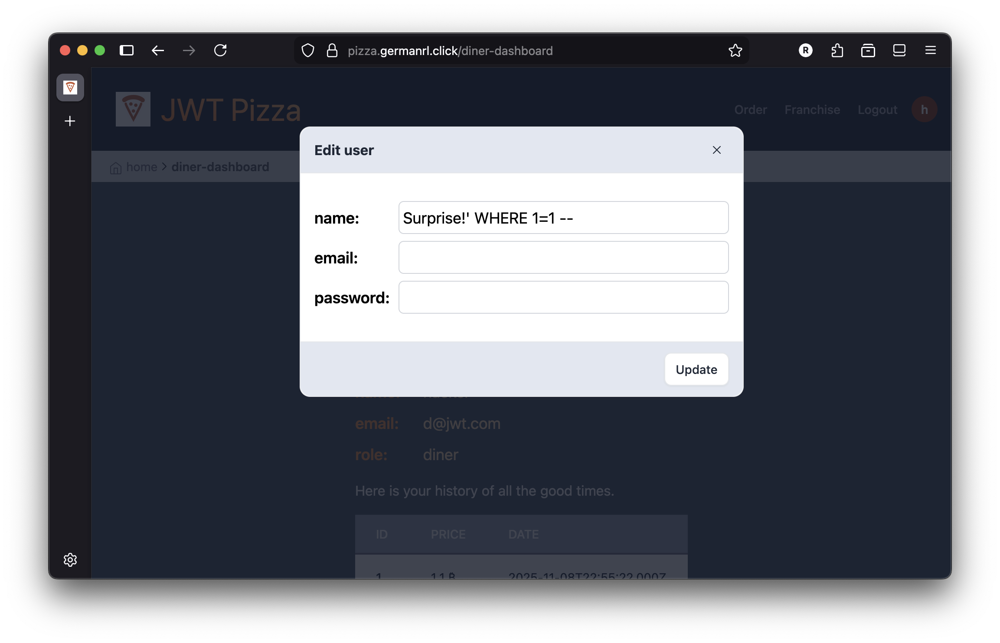
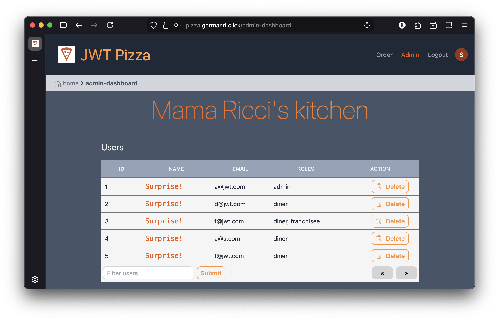
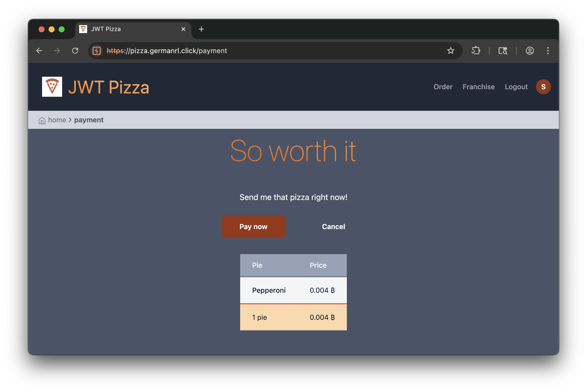
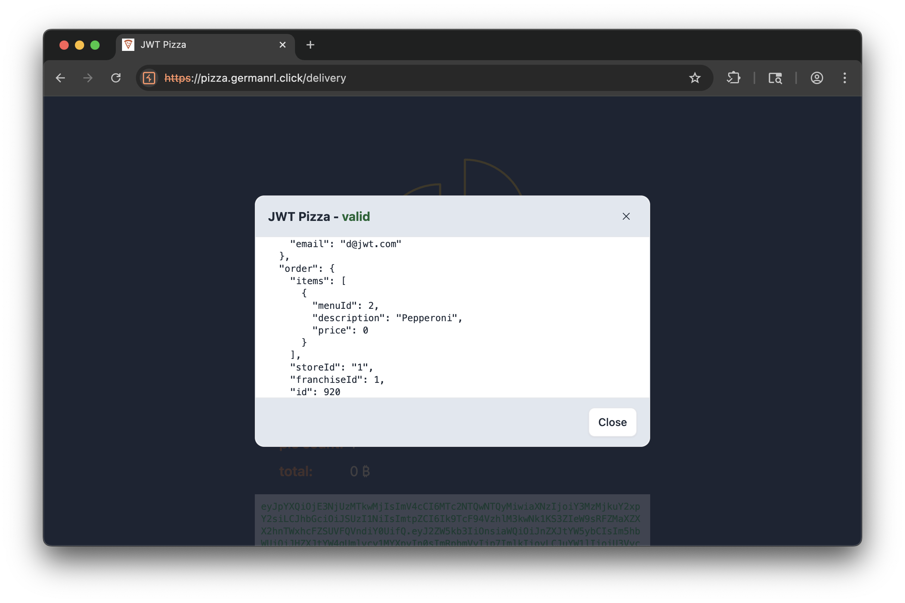
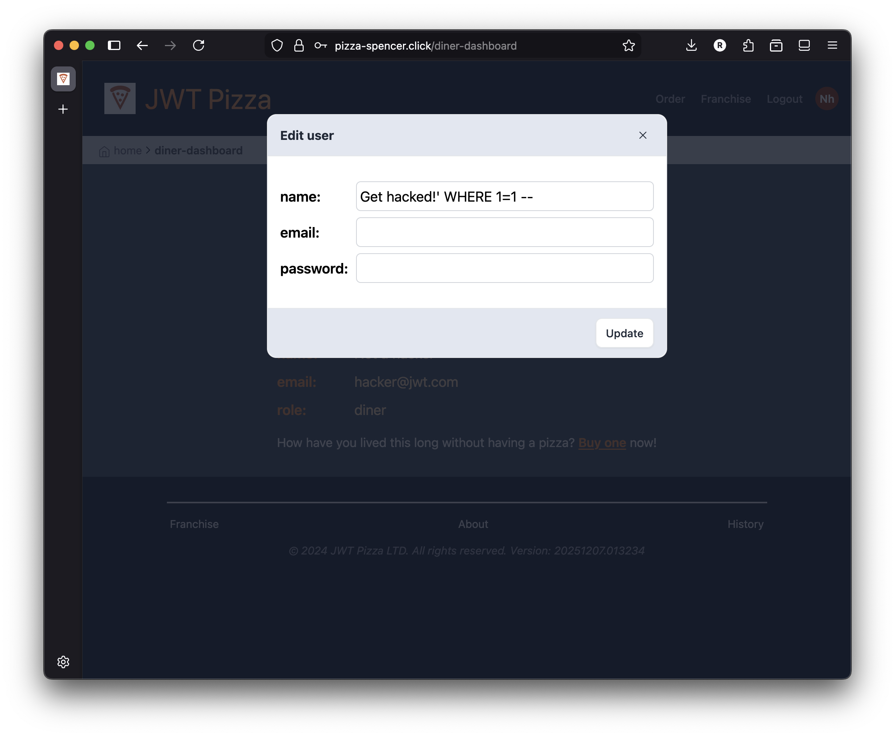
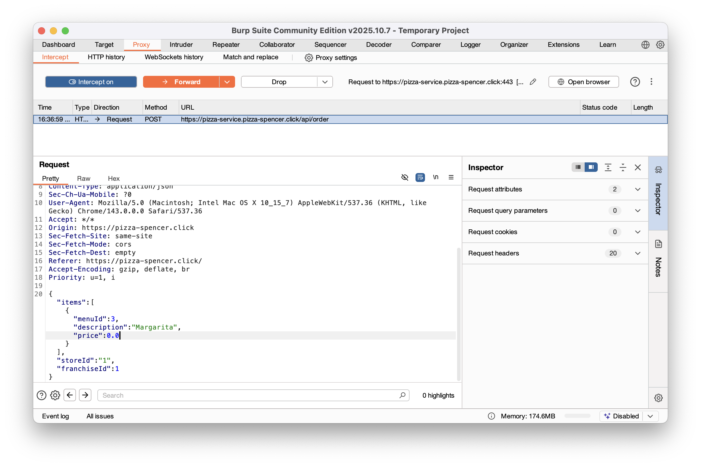

# Penetration Test Report

**Peer 1:** Spencer Clingo (pizza.pizza-spencer.click)

**Peer 2:** German Rios-Lazo (pizza.germanrl.click)

# Self Attack

## Peer 1 - Spencer Clingo

**Target:** pizza.pizza-spencer.click

### Attack 1: Default Admin Login

-   **Date:** December 9, 2025
-   **Classification:** Identification and Authentication Failures
-   **Severity:** 0 - Unsuccessful
-   **Description:** Attempted to login with default system admin username and password. The system correctly rejected the default credentials.
-   **Corrections:** Default accounts were previously removed/secured.

### Attack 2: Password Change

-   **Date:** December 9, 2025
-   **Classification:** Broken Access Control
-   **Severity:** 0 - Unsuccessful
-   **Description:** Attempted to login with a diner account default password. Access was denied.
-   **Corrections:** Default accounts were previously removed/secured.

### Attack 3: Admin Login Bypass (HTML Edit)

-   **Date:** December 9, 2025
-   **Classification:** Broken Access Control
-   **Severity:** 0 - Unsuccessful
-   **Description:** Attempted to login to admin account with no password by editing the HTML form to bypass client-side checks. Server rejected the empty password.
-   **Corrections:** Server-side validation handles missing password fields correctly.

### Attack 4: SQL Injection (Name Parameter)

-   **Date:** December 9, 2025
-   **Classification:** Injection
-   **Severity:** 0 - Unsuccessful
-   **Description:** Attempted to update all passwords by injecting a SQL query into the name parameter of a user update request. The attack failed to alter the database.
-   **Corrections:** Input sanitization prevents SQL injection in the User PUT endpoint.

## Peer 2 - German Rios-Lazo

**Target:** pizza.germanrl.click

### Attack 1:

| Item           | Result                                               |
| -------------- | -----------------------------------------------------|
| Date           | December 9, 2025                                     |
| Target         | pizza.germanrl.click                                 |
| Classification | Injection                                            |
| Severity       | 2 - High                                             |
| Description    | Injected a SQL query by entering it in the name field when updating a user. The attack was successful, and I was able to update all usernames in the database. Similar queries can potentially be injected to change passwords, delete all users, etc. |
| Images         |     |
| Corrections    | Sanitize inputs in SQL query when updating user.     |

### Attack 2:

| Item           | Result                                               |
| -------------- | -----------------------------------------------------|
| Date           | December 9, 2025                                     |
| Target         | pizza.germanrl.click                                 |
| Classification | Injection / Request Tampering                        |
| Severity       | 3 - Medium                                           |
| Description    | Injected a price of 0.0 for a pizza order by intercepting and modifying the request using the Burp Suite. Once the order was completed and validated, it still showed a price of 0, which basically means getting free pizzas. |
| Images         |        |
| Corrections    | Ensure that important transaction data is stored securely in the database and retrieved from there instead of passing it unnecessarily in an HTTP request that can be intercepted. |

---

# Peer Attack

## Peer 1 attack on peer 2

**Attacker:** Spencer Clingo

**Target:** pizza.germanrl.click

### Attack 1: Default Admin Login

-   **Date:** December 9, 2025
-   **Classification:** Security Misconfiguration
-   **Severity:** 3 - High
-   **Description:** Login with default admin username and password was successful. This granted full administrative access, allowing the attacker to do anything an admin can do.
-   **Corrections:** Change default admin credentials immediately upon deployment.

### Attack 2: Password Change

-   **Date:** December 9, 2025
-   **Classification:** Broken Access Control
-   **Severity:** 2 - Medium
-   **Description:** Logged in with a default diner account and successfully changed a the user's password, locking the original account owner out of the account. If payment information were stored in accounts, that would also be compromised.
-   **Corrections:** Verify that the user requesting the change matches the ID of the user being modified in the backend service.

### Attack 3: Admin Login Bypass (HTML Edit)

-   **Date:** December 9, 2025
-   **Classification:** Broken Access Control
-   **Severity:** 3 - High
-   **Description:** Successfully logged into the admin account without a password by editing the HTML input field. This provides free access to any account as long as you know the email.
-   **Corrections:** Implement strict server-side validation to ensure password fields are not empty, regardless of client-side HTML state.

### Attack 4: SQL Injection (User ID)

-   **Date:** December 9, 2025
-   **Classification:** Injection
-   **Severity:** 0 - Unsuccessful
-   **Description:** Attempted to update all users with a SQL injection attack in the `userId`. The attack failed as it was blocked by the original code.
-   **Corrections:** None needed (Attack blocked).

### Attack 5: SQL Injection (Franchise Request)

-   **Date:** December 9, 2025
-   **Classification:** Injection
-   **Severity:** 0 - Unsuccessful
-   **Description:** Attempted SQL injection into `getFranchises` request. Failed because Node.js MySQL driver automatically rejects multi-query (stacked) queries.
-   **Corrections:** None needed (Attack blocked).

### Attack 6: SQL Injection (Name Parameter)

-   **Date:** December 9, 2025
-   **Classification:** Injection
-   **Severity:** 4 - Critical
-   **Description:** Successfully updated passwords by injecting a SQL query into the `name` parameter of a user update request. Because the password field is processed first in the code, the injected SQL was included and set all passwords to the new password.
    -   **Payload:** `{"name":"hacker\" WHERE 1=1#", "password":"password"}`.
    -   **Impact:** Any account where the email is known can be accessed. Emails could also be changed using a similar tactic.
-   **Corrections:** Sanitize all user inputs in the update endpoints. Use parameterized queries.

## Peer 2 attack on peer 1

**Attacker:** German Rios-Lazo

**Target:** pizza.pizza-spencer.click

### Attack 1:

| Item           | Result                                               |
| -------------- | -----------------------------------------------------|
| Date           | December 8, 2025                                     |
| Target         | pizza.pizza-spencer.click                            |
| Classification | Injection                                            |
| Severity       | 0 - Unsuccessful                                     |
| Description    | Attempted SQL injection by entering a query in the name field when updating a user. The attack was unsuccessful, which means that the inputs are being sanitized correctly. |
| Images         |          |
| Corrections    | None needed.                                         |

### Attack 2:

| Item           | Result                                               |
| -------------- | -----------------------------------------------------|
| Date           | December 8, 2025                                     |
| Target         | pizza.pizza-spencer.click                            |
| Classification | Injection / Request Tampering                        |
| Severity       | 0 - Unsuccessful                                     |
| Description    | Attempted unsuccessfully to inject a price of 0.0 to an order by intercepting the request using the Burp Suite, modifying it, and forwarding it to the server. |
| Images         |  |
| Corrections    | None needed.                                         |

---

## Combined Summary of Learnings

Through this penetration testing exercise, we identified that Input Sanitization and Default Credentials are critical vulnerabilities. When credentials are left at the default values, companies risk someone with knowledge of how the resource begins easily penetrating all security measures. 

If not handled properly, SQL injection is a powerful attack that can allow malicious actors to obtain or modify user credentials. If a user with an admin role is compromised, attackers can even get full access to the application by exploiting this type of vulnerability. Input sanitization and using parameterized queries are the best ways to prevent SQL injection.

Intercepting and tampering with HTTP requests is another attack vector that allows hackers to inject their own data into an application. In the case of monetary transactions, this can lead to financial loss, fraud, and many other consequences. To prevent this, it is necessary to enforce strong server-side validations, and to avoid passing data as parameters that should be stored securely somewhere else, outside of the control of the user.
